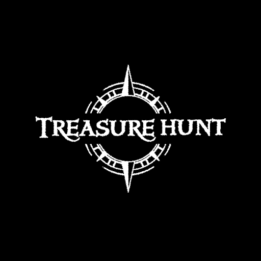
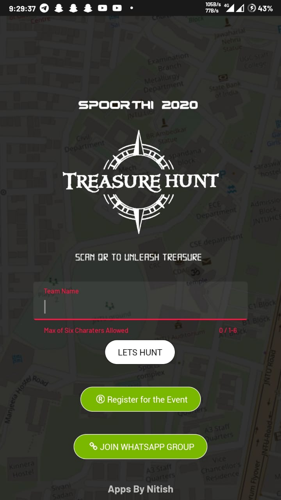
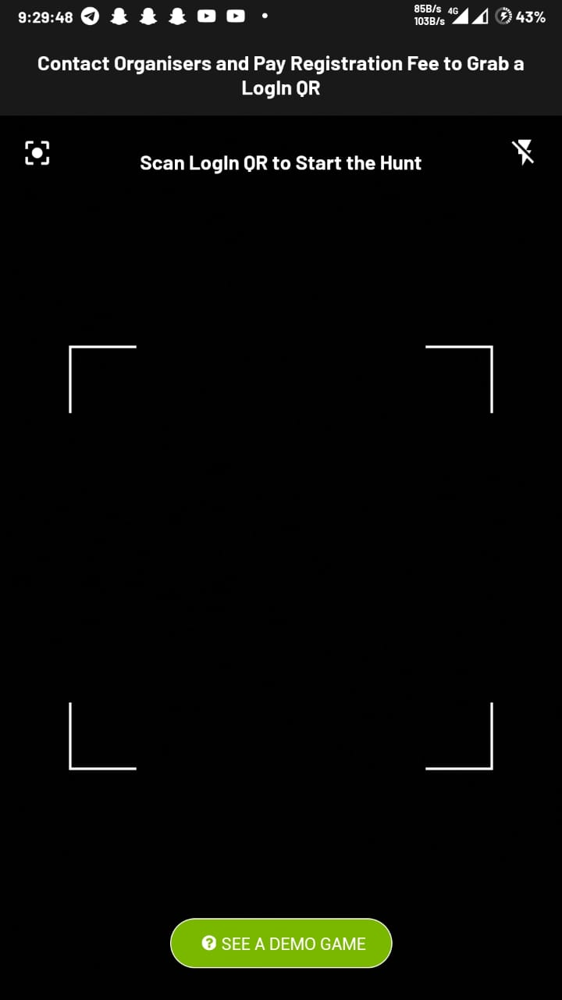
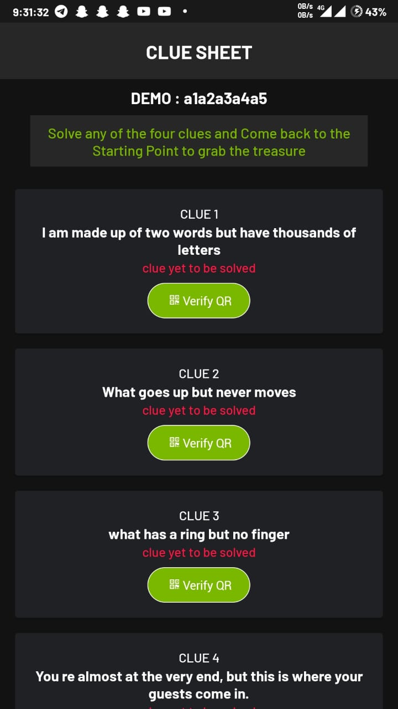
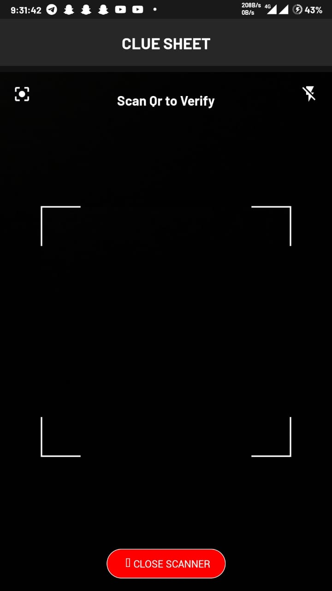
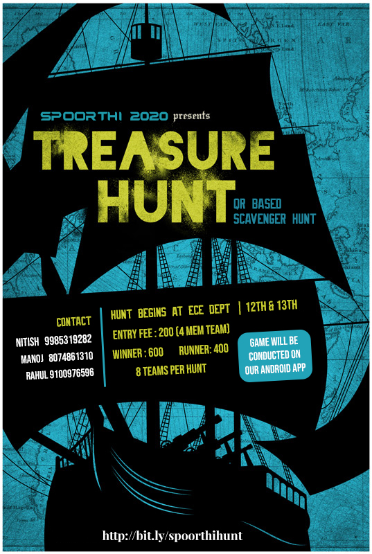

# QR_Hunt
💰 App for QR Based Treasure Hunt Game for our College fest <br>

### Find all Clues and Answers here in this [ClueSheet](https://nitishgadangi.github.io/QR_Hunt/)
### [Try it out on Instagram as AR Filter](https://bit.ly/insidejntuhceh)

### Now Available on Playstore

[](https://play.google.com/store/apps/details?id=com.nitish.qrhunt)

**Screenshots**

<table>
    <tr>
     <td><kbd></kbd></td>
     <td><kbd></kbd></td>
     <td><kbd></kbd></td>
     <td><kbd></kbd></td>
    </tr>
</table>
         
## Development
* Edit ```strings.xml``` to add your own questions
* This app uses AES bases Encrypted QRs for in game Transactions. The **Master app** for generation of valid QRs can be downloaded from **[here](https://github.com/NitishGadangi/QR_Hunt-Master)** <br>

## About TREASURE HUNT @JNTUH [SPOORTHI 2k20]
**A QR Based Scavenger Hunt Game** <br>

Ever fancied to step foot in an explorer’s shoes and get set in search for hidden treasures?

Spoorthi 2k20 presents you, Treasure Hunt! Tease your brain, solve clues and find locations inside JNTUH to win cash prizes.

TREASURE HUNT allows you to experience the thrill in solving the clues guiding the treasure..

<table>
    <tr>
     <td><kbd></kbd></td>
    </tr>
</table>

*☠️ WARNING:-* <br>
*Treasure hunting is not for the faint-hearted, so expect some real obstacles in your way!* <br>
 
**HOW THE HUNTING GOES:-** <br> 
[ 4 Hunters per Team | 8 Teams per Each Hunt ] <br>
-> Hunt begins in the ECE department where each team is provided with an ANDROID APP. <br>
-> FIVE clues guiding the treasure will be given to each team. <br>
-> Team members should solve each clue and reach the corresponding location and scan the QR present at that location. <br>
-> Solve any FOUR clues out of FIVE and get back to the Starting Point (ECE department) <br>
-> The first team to reach the starting point(ECE department) will be declared the winner. <br>


for more details visit : http://www.jntuhspoorthi.com/spoorthi2020/events/index.html

## License
```
The MIT License (MIT)
Copyright (c) 2020 Nitish Gadangi

Permission is hereby granted, free of charge, to any person obtaining a copy of this software and associated documentation files (the "Software"), to deal in the Software without restriction, including without limitation the rights to use, copy, modify, merge, publish, distribute, sublicense, and/or sell copies of the Software, and to permit persons to whom the Software is furnished to do so, subject to the following conditions:

The above copyright notice and this permission notice shall be included in all copies or substantial portions of the Software.

THE SOFTWARE IS PROVIDED "AS IS", WITHOUT WARRANTY OF ANY KIND, EXPRESS OR IMPLIED, INCLUDING BUT NOT LIMITED TO THE WARRANTIES OF MERCHANTABILITY, FITNESS FOR A PARTICULAR PURPOSE AND NONINFRINGEMENT. IN NO EVENT SHALL THE AUTHORS OR COPYRIGHT HOLDERS BE LIABLE FOR ANY CLAIM, DAMAGES OR OTHER LIABILITY, WHETHER IN AN ACTION OF CONTRACT, TORT OR OTHERWISE, ARISING FROM, OUT OF OR IN CONNECTION WITH THE SOFTWARE OR THE USE OR OTHER DEALINGS IN THE SOFTWARE.
```

**Made with ❤️ by Nitish**
